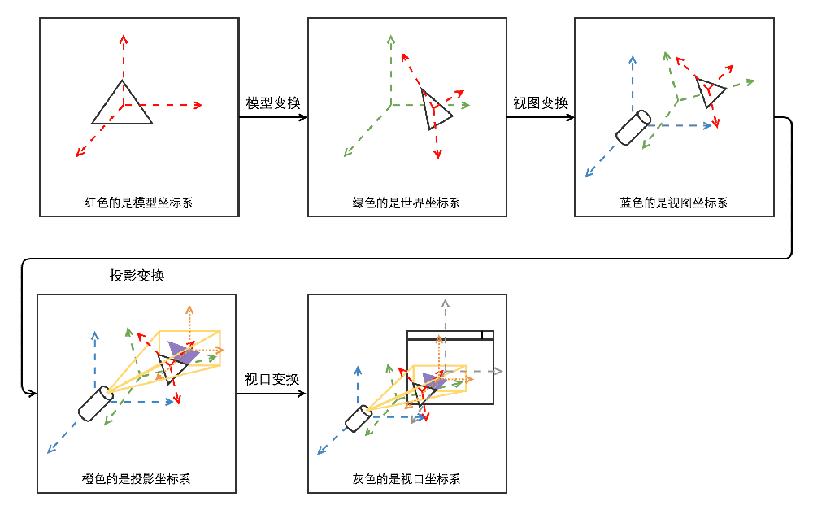

### 3d矩阵介绍
http://zhangwenli.com/blog/2015/08/28/opengl-matrix-transformations/

http://www.cnblogs.com/kesalin/archive/2012/12/06/3D_math.html

#### 1. 3D世界中矩阵作用
用矩阵来表示3D变换，但矩阵在表示旋转时可能会导致万向节锁的问题，而使用四元数可以避免万向节锁


矩阵运算规则：

    1) 若矩阵 A 和 B 不是互逆矩阵，则不满足乘法交换律，即 A × B 不等于 B × A； 
    2) M × N 阶的矩阵只能和 N × O 阶的矩阵相乘，即 N 的阶数相等，结果为 M × O 阶的矩阵； 
    3) 矩阵 A × B 的运算过程是 A 的每一行依次乘以 B 的每一列作为结果矩阵中的一行； 
    4) 矩阵 A 的逆矩阵 B 满足 A × B = B × A = 单位矩阵。  
    5) 单位矩阵是对角线上的值为1，其余均为 0 的矩阵。单位矩阵不影响坐标变换（你可以将下面的3D变换矩阵换成单位矩阵来思考下）。

#### webgl世界中的坐标系

```
1. 模型坐标系
定义:
    用于指定模型各个点的位置的参考系
var vertices = [
    1, 0, 0.5,
    -0.5, 0, 0.5,
    0, 1, 0
];
gl.bufferData(gl.ARRAY_BUFFER, new Float32Array(vertices), gl.STATIC_DRAW);

2. 世界坐标系
定义: 
    世界坐标系就是所有模型共享的参考系, 其实就是模型经过平移/旋转/缩放操作后, 得到模型位置的坐标系.

3. 视图坐标系
定义:
    指定一个照相机的位置和角度，然后去观察世界坐标系下的物体, 在世界坐标系经过视图矩阵的转换,  得到模型位置的坐标系.
const eye = [x1, y1, z1];   // 视点
const at = [x2, y2, z2];    // 观察点
const up = [x3, y3, z3];    // 向上的方向
const viewMatrix = lookAt(eye, at, up); // 计算出视图矩阵

4. 投影坐标系
定义:
    确定了模型在视图坐标系中的位置后, 观察物体的投影方式不同(远景/正交)决定了看到问题的效果不同.

远景投影矩阵: 
PerspectiveCamera(fov, aspect, near, far)
fov — 相机视锥体垂直视角
aspect — 相机视锥体宽高比
near — 相机视锥体近裁剪面
far — 相机视锥体远裁剪面

正交投影矩阵:
OrthographicCamera( left, right, top, bottom, near, far )
left — 相机视椎体（Camera frustum）左面
right — 相机视椎体（Camera frustum）右面
top — 相机视椎体（Camera frustum）上面
bottom — 相机视椎体（Camera frustum）下面
near — 相机视椎体（Camera frustum）前面（靠近相机的这一面）
far — 相机视椎体（Camera frustum）后面（远离相机的这一面）


5. 视口坐标系
定义:
    只是一个非常简单的 XoY 平面上的缩放，它决定了最终渲染到平面的哪一块，所以用之前的缩放同样处理就能得到相应矩阵了.
    
    gl.viewport(0, 0, this._canvas.width, this._canvas.height);
    
    
坐标系之间的转换和伴随产生的矩阵
模型坐标系------>世界坐标系---------->视图坐标系--------->投影坐标系--------->视口坐标系
          |                 |                 |                  |
        模型矩阵          视图矩阵            投影矩阵             视口投影
    (平移/旋转/缩放)
    
变换后的坐标 = 视口矩阵 x 投影矩阵 x 视图矩阵 x 模型矩阵 x 模型点坐标
```

#### 2. 矩阵变换
(1).通常我们使用 4 维向量 (x, y, z, w) 表示在3D空间中的一个点，最后一维 w 表示齐次坐标。齐次坐标的含义是两条平行线在投影平面的无穷远处相交于一点，但在 Matrix 中没有表示无穷大，所以增加了齐次坐标这一维;

(2). 用数组表示 Matrix 又分为两种形式：行主序和列主序，它们在本质上是等价的，只不过是一个是右乘（行主序，矩阵放右边）和一个是左乘（列主序，矩阵放左边）

(3). WebGL 使用列主序矩阵，即列矩阵，因此我们总是倒过来算的（左乘矩阵，变换效果是按从右向左的顺序进行）： 视口矩阵 × 投影矩阵 × 视图矩阵 × 模型矩阵 × 3D位置
    
    视口矩阵: viewport 变换发生在投影到2D 投影平面之后，该变换是将投影之后归一化的点映射到屏幕上一块区域内的坐标;
             gl.viewport(0, 0, gl.drawingBufferWidth, gl.drawingBufferHeight); 
             
    投影矩阵: 定义可视化区域，两种方式“透视投影”和“正交投影”;
    
    视图矩阵: 为了将物体从世界坐标转换到相机视线所在视图空间中来; 
             glMatrix.lookAt();
             
    模型矩阵: 变换模型, 如: 平移, 旋转, 缩放等;

#### 3. 逆转置矩阵
(1).逆矩阵含义：
    如果M*R 或 R*M的结果都是单位矩阵， 则M和R将互为逆矩阵;

(2).转置的含义：
    将矩阵的行列进行调换


#### 4. 矩阵运算
(1). 矢量和浮点型的运算(支持交换律)

    v3b = v3a + f;
    -----------------------------
    v3b.x = v3a.x + f;
    v3b.y = v3a.y + f;
    v3b.z = v3a.z + f;

(2). 矢量和矢量的运算(支持交换律)

    v3c = v3a + v3b;
    -----------------------------
    v3c.x = v3a.x + v3b.x;
    v3c.y = v3a.y + v3b.y;
    v3c.z = v3a.z + v3b.z;

(3). 矩阵和浮点型的运算

    m3b = m3a * f;
    -----------------------------
    m3b[0].x = v3a[0].x * f;
    m3b[0].y = v3a[0].y * f;
    m3b[0].z = v3a[0].z * f;

    m3b[1].x = v3a[1].x * f;
    m3b[1].y = v3a[1].y * f;
    m3b[1].z = v3a[1].z * f;

    m3b[2].x = v3a[2].x * f;
    m3b[2].y = v3a[2].y * f;
    m3b[2].z = v3a[2].z * f;

(4). 矩阵右乘矢量的运算

    v3b = m3a * v3a;
    -----------------------------
    v3b.x = m3a[0].x * v3a.x + m3a[1].x * v3a.y + m3a[2].x * v3a.z;

    v3b.y = m3a[0].y * v3a.x + m3a[1].y * v3a.y + m3a[2].y * v3a.z;

    v3b.z = m3a[0].z * v3a.x + m3a[1].z * v3a.y + m3a[2].z * v3a.z;

(5). 矩阵左乘矢量的运算

    v3b = v3a * m3a;
    -----------------------------
    v3b.x = v3a.x * m3a[0].x + v3a.y * m3a[0].y + v3a.z * m3a[0].z;

    v3b.y = v3a.x * m3a[1].x + v3a.y * m3a[1].y + v3a.z * m3a[1].z;

    v3b.z = v3a.x * m3a[2].x + v3a.y * m3a[2].y + v3a.z * m3a[2].z;

(6). 矩阵乘以矩阵的运算

    m3c = m3a * m3b;
    左矩阵的行 * 右矩阵的列 然后求和
    -----------------------------
    m3c[0].x = m3a[0].x * m3b[0].x + m3a[1].x * m3b[0].y + m3a[2].x * m3b[0].z;
    m3c[0].y = m3a[0].x * m3b[1].x + m3a[1].x * m3b[1].y + m3a[2].x * m3b[1].z;
    m3c[0].z = m3a[0].x * m3b[2].x + m3a[1].x * m3b[2].y + m3a[2].x * m3b[2].z;

    m3c[1].x = m3a[0].y * m3b[0].x + m3a[1].y * m3b[0].y + m3a[2].y * m3b[0].z;
    m3c[1].y = m3a[0].y * m3b[1].x + m3a[1].y * m3b[1].y + m3a[2].y * m3b[1].z;
    m3c[1].z = m3a[0].y * m3b[2].x + m3a[1].y * m3b[2].y + m3a[2].y * m3b[2].z;

    m3c[2].x = m3a[0].z * m3b[0].x + m3a[1].z * m3b[0].y + m3a[2].z * m3b[0].z;
    m3c[2].y = m3a[0].z * m3b[1].x + m3a[1].z * m3b[1].y + m3a[2].z * m3b[1].z;
    m3c[2].z = m3a[0].z * m3b[2].x + m3a[1].z * m3b[2].y + m3a[2].z * m3b[2].z;


